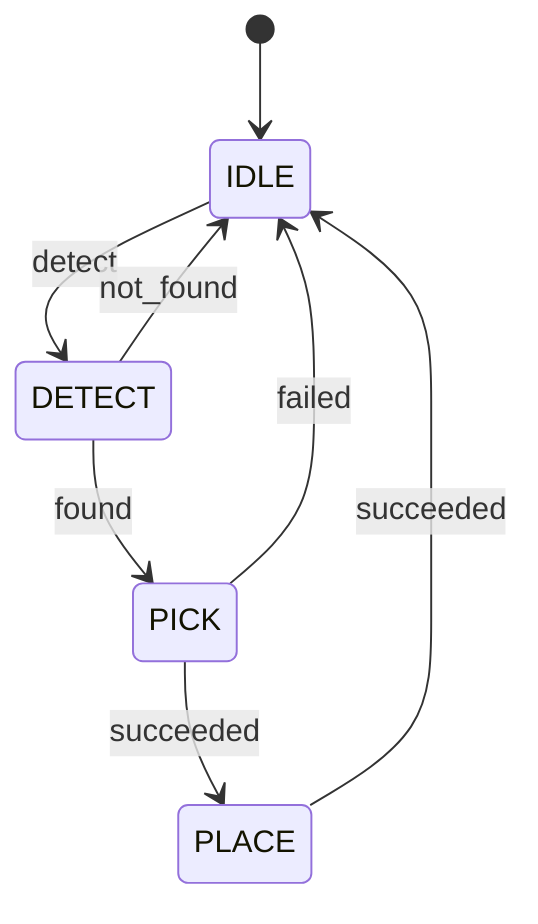

# State Diagram

상태 머신 다이어그램을 생성하고 검증합니다.

## Arguments

- `task_description`: 작업 흐름 설명
- `--format`: 출력 형식 (mermaid, ascii) 기본값: ascii
- `--validate`: 기존 SM 코드 검증

## Workflow

```
1. Analyze task flow
2. Identify states and transitions
3. Generate diagram
4. Validate completeness
```

## Output Formats

### ASCII
```
┌─────────┐  detect   ┌─────────┐  found   ┌─────────┐
│  IDLE   │─────────▶│ DETECT  │────────▶│  PICK   │
└─────────┘          └─────────┘          └─────────┘
     ▲                                         │
     │              succeeded                  │
     └─────────────────────────────────────────┘
```

### Mermaid


## Validation Checklist

```
□ All states reachable
□ No dead-end states (except terminal)
□ Error transitions defined
□ Timeout handling exists
□ Initial state defined
□ Terminal states defined
```

## Examples

```bash
/state-diagram "pick object and place on conveyor"
/state-diagram --format mermaid "detect, grasp, move, release"
/state-diagram --validate src/state_machine.py
```

## Agent Integration

복잡한 상태 머신 설계:
```
Use the state-machine-designer agent to implement the full state machine
```
